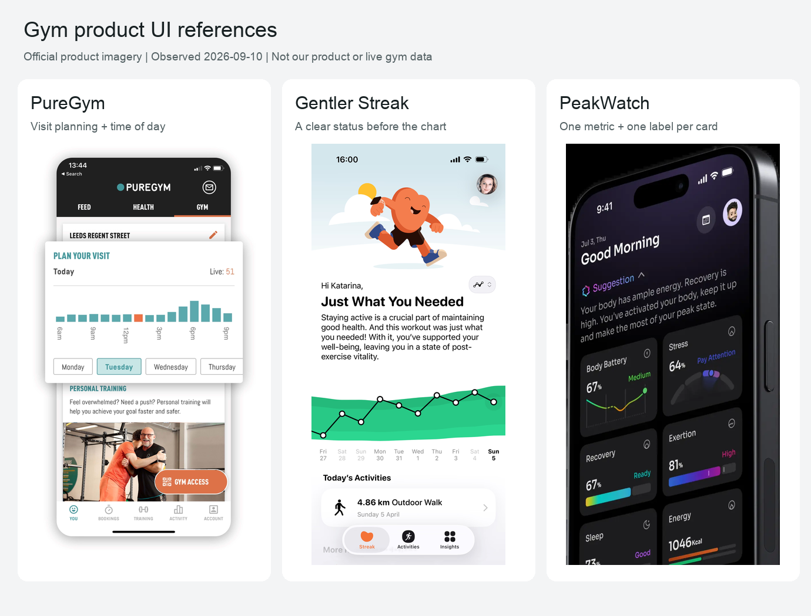

# 健身房产品UI参考图册

Owner: Product Lead
Last updated: 2026-09-10
Source: 以下三个产品官网；原始素材URL见manifest.json
Confidence: High（图片来自公开官网）；Medium（设计判断）
Related decisions: [功能与UI研究](../../ideas/gym-occupancy/product-feature-ui-research-2026-09-10.md)
Next review date: 2026-10-10

这些是官网展示的真实产品界面素材，并非本店原型、实测画面或实时数据。版权归原权利人，保存用于本次内部评论与比较，未取得再利用为产品素材的授权。并排图只等比缩小并加标签，没有重绘界面；原始URL与处理方式见[素材清单](manifest.json)。

| 产品 | 观察位置 | 借鉴与取舍 |
| --- | --- | --- |
| [PureGym官网](https://www.puregym.com/app/) | 页面人数展示图 | 当前人数＋分时柱图；仅取这个任务模块，不搬整页营销与导航 |
| [Gentler Streak官网](https://gentlerstories.com/gentlerstreak) | 首屏手机展示 | 先说明状态、再给活动路径；我们的首屏不需同等面积插画与长段落 |
| [PeakWatch官网](https://www.peakwatch.co/) | 首屏手机展示 | 数值、状态词、趋势同卡；我们的首页减少指标与颜色数量 |

## 查看单张原图

- [PureGym人数界面](puregym.png)
- [Gentler Streak状态界面](gentler-streak.png)
- [PeakWatch卡片界面](peakwatch.png)

## 其他值得直接打开的参考

- [Strong](https://www.strong.app/)：官网训练界面演示；整体视觉基调的首选参考，白底、轻列表、数字对齐。本轮未另下载视频。
- [Hevy](https://www.hevyapp.com/)：官网训练记录与统计截图；看操作按钮和完成状态。
- [Workout.lol](https://workout.lol/)：可直接操作器械选择；本轮体验前两步。
- [Gymdesk会员指南](https://docs.gymdesk.com/en/help/docs/member-portal-guide)：看会员状态和课表流程，非已实测的优秀UI结论。
